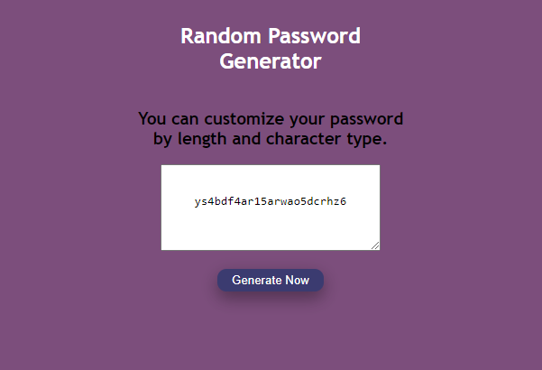

# UPDATED-password-generator
## Licensing:

## Description
A simple app to produce a random password according to a user's specifications for length and type of character to include. Updated version of class project built from scratch without starter code.

## Story
I am going to redo particularly interesting or challenging class projects from scratch to see how far I've come in my learning to code journey.

### Original Project
The password generator was our first JavaScript project. While I managed to build a functioning app, I did not really understand why it worked.
_see it here_
https://github.com/shelleymcq/Password-Generator

## Table of Contents
* [Installation](#Installation)
* [Usage](#Usage)
* [Technologies](#Technologies)
* [Questions](#Contact)
## Installation
Fork this repo and download the files to your local environment. 
## Usage
### Deployed App
https://shelleymcq.github.io/UPDATED-password-generator/

## Technologies
* HTML
* CSS
* JavaScript
## Contact 
https://github.com/shelleymcq or shelleymcq.dev@gmail.com
